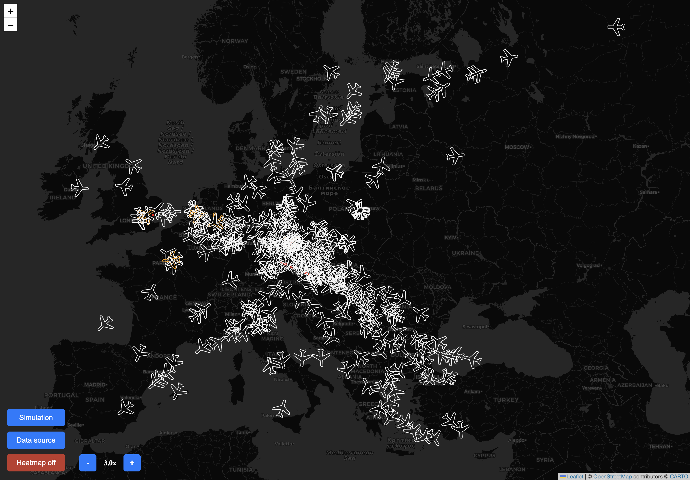

# Medium-term Collision Detection heatmap visualization
This application ingest flight data from BlueSky or NM B2B, based on that 
predicts trajectory in almost real-time and predicts possible collisions between pair of flights.
These flights and possible collisions are then visualized live on map and later on in a heatmap.
Application was developed as part of the Bachelor's thesis.

# How to run
1. Unzip files from `nm-b2b-structure-data/zipped` to `nm-b2b-structure-data/`
2. `docker compose up -d`
3. `make initial-startup` - migrate structure to database and loads structure data into database
4. `make start-flight-sync-script` - start script that synchronizes flight data from BlueSky into database
5. `start-create-mtcd-pairs-script` - start script that creates mtcd pairs that could have conflict

# Development tools
## Python codebase
- linter `pylint --rcfile=pylint.rc .`
- tests `make test`
- code coverage `pytest --cov=. --cov-report=term --cov-config=.coveragerc`

## Javascript codebase
- linter `cd web-server && npx eslint .`
- formatter `cd web-server/static/js && npx prettier --check .`
  - apply `cd web-server/static/js && npx prettier --write .`